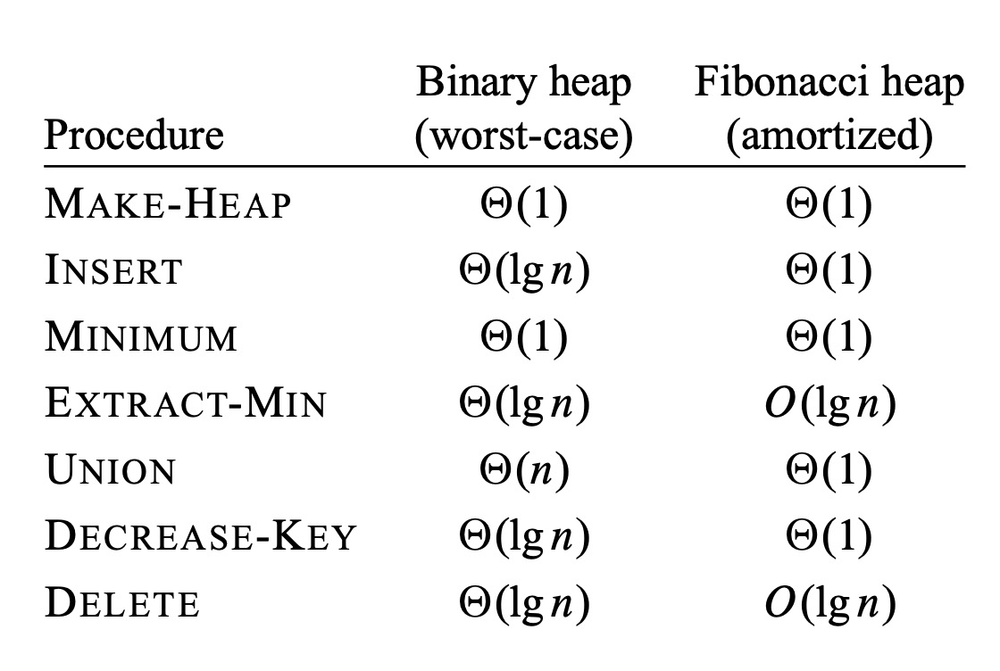

# Fibonacci Heaps

## Todo

- [x] setup writing

  - [x] setup typst / latex
  - [x] setup zotero for literature
  - [x] setup presentation

- collect literature

  - [x] Michael L. Fredman, Robert E. Tarjan: Fibonacci heaps and their uses in improved network optimization algorithms. Journal of the ACM (JACM). Volume 34, Issue 3, July 1987 (Pages 596-615).
  - [x] clrs

- research
  - read literature
    - [x] read grokking algorithms
- understand the algorithm
- try the algorithm on paper

## Structure

1. Einleitung
   Einführung in das Thema: Warum sind Datenstrukturen wie Heaps wichtig?
   Motivation: Wofür werden Fibonacci-Heaps verwendet, und was ist ihr Nutzen?
   Ziel der Arbeit: Was soll die Arbeit vermitteln?
2. Grundlagen
   Datenstrukturen und Heaps: Eine kurze Einführung in Heaps (Binäre Heaps, Binomial Heaps, etc.).
   Fibonacci-Folge: Erklärung der Fibonacci-Folge und deren Bedeutung für Fibonacci-Heaps.
   Problemstellung: Typische Probleme, die mit Heaps gelöst werden (z. B. Dijkstra-Algorithmus, Prim-Algorithmus).
3. Fibonacci-Heap: Definition und Aufbau
   Definition: Was ist ein Fibonacci-Heap?
   Struktur:
   Wurzel-Liste
   Rangkonzept
   Knotenstruktur (z. B. markierte und unmarkierte Knoten)
   Besonderheiten im Vergleich zu anderen Heaps: Was unterscheidet den Fibonacci-Heap von binären oder binomialen Heaps?
4. Operationen in Fibonacci-Heaps
   Insert: Einfügen eines neuen Elements.
   Find Minimum: Suchen des kleinsten Elements.
   Extract Minimum: Entfernen des kleinsten Elements.
   Union: Verschmelzen von zwei Heaps.
   Decrease Key: Verringern des Schlüssels eines Knotens.
   Delete: Löschen eines Knotens.
   Laufzeitanalyse der Operationen: Amortisierte Laufzeiten für jede Operation.
5. Amortisierte Analyse
   Amortisierte Kosten: Definition und Bedeutung für Fibonacci-Heaps.
   Potentialfunktion: Erklärung der Potentialmethode zur Analyse der Operationen.
   Laufzeit-Komplexitäten: Vergleich der amortisierten und realen Laufzeiten für verschiedene Operationen.
6. Anwendungen von Fibonacci-Heaps
   Graphenalgorithmen: Prim-Algorithmus, Dijkstra-Algorithmus.
   Andere Algorithmen: Weitere Einsatzmöglichkeiten von Fibonacci-Heaps in der Praxis.
7. Vergleich mit anderen Heaps
   Binomial Heaps vs. Fibonacci-Heaps: Unterschiede in Struktur und Laufzeiten.
   Binäre Heaps vs. Fibonacci-Heaps: Wann ist ein Fibonacci-Heap vorteilhafter?
   Vor- und Nachteile: Wann sollten Fibonacci-Heaps verwendet werden?
8. Fazit und Ausblick
   Zusammenfassung: Wiederholung der wichtigsten Punkte.
   Ausblick: Mögliche Weiterentwicklungen und zukünftige Forschungsthemen.
9. Literaturverzeichnis
   Auflistung aller verwendeten Quellen.

## Guide

1. Recherche und Informationsbeschaffung
   Schritt 1: Grundlagenliteratur lesen

- Beginne mit einem Überblick über grundlegende Datenstrukturen und Heaps in Algorithmen-Büchern (z.B. "Introduction to Algorithms" von Cormen et al.).

- Schaue nach Artikeln und Lehrvideos zu Fibonacci-Heaps (YouTube, Coursera, etc.).

- Nutze wissenschaftliche Datenbanken (z.B. Google Scholar, SpringerLink, IEEE Xplore) für Forschungspapiere und vertiefte Materialien.

- Schritt 2: Fibonacci-Heaps im Detail

Lies detaillierte Erklärungen zu Fibonacci-Heaps. Finde Ressourcen, die den Aufbau, die Operationen und die amortisierte Analyse erklären.
Stelle sicher, dass du auch die mathematischen Konzepte (wie die amortisierte Analyse und Potentialfunktion) verstehst, da sie für das Thema wichtig sind.
Schritt 3: Beispiele und Anwendungen

Studiere, wie Fibonacci-Heaps in Algorithmen wie dem Dijkstra- oder Prim-Algorithmus angewendet werden. Verstehe genau, welche Vorteile sie gegenüber anderen Heaps bieten.
Finde Code-Beispiele und Implementierungen von Fibonacci-Heaps (z.B. auf GitHub oder in Lehrbüchern). 2. Erstellen der Seminararbeit
Schritt 1: Struktur planen (siehe Outline oben)

Plane die Struktur deiner Arbeit (Titel, Einleitung, Hauptteil, Fazit). Nutze die Outline aus der vorherigen Antwort als Vorlage.
Beginne mit den Kapiteln, in denen du sicherer bist (z.B. Grundlagen oder Definitionen), und arbeite dich zu den komplexeren Themen (z.B. amortisierte Analyse) vor.
Schritt 2: Schreibprozess

Schreibe in Etappen: Arbeite jeden Abschnitt einzeln ab, anstatt alles auf einmal zu schreiben. Beginne mit einem einfachen Entwurf und erweitere diesen nach und nach.
Erkläre komplexe Konzepte einfach: Für einen Leser, der das Thema nicht kennt, sind klare und verständliche Erklärungen entscheidend. Nutze Beispiele und Diagramme.
Belege deine Aussagen: Nutze Zitate und Verweise auf Literatur, um deine Erklärungen zu stützen.
Schritt 3: Überarbeitung und Feinschliff

Proofreading: Lies deine Arbeit mehrmals, um Fehler zu korrigieren und den Text zu verbessern.
Feedback einholen: Lasse die Arbeit von Kommilitonen oder einem Betreuer lesen, um Feedback zu erhalten.
Diagramme und Abbildungen einfügen: Visualisiere Prozesse und Algorithmen, um die Verständlichkeit zu erhöhen. 3. Vorbereitung der Präsentation
Schritt 1: Präsentationsstruktur

Eröffnung: Beginne mit einer allgemeinen Einführung zu Heaps und warum Fibonacci-Heaps nützlich sind.
Hauptteil: Erläutere die Struktur und Operationen von Fibonacci-Heaps. Nutze Diagramme, um die einzelnen Schritte (z.B. Insert, Extract-Min, Union) zu veranschaulichen.
Schluss: Fasse die Vorteile von Fibonacci-Heaps zusammen und gehe auf deren Einsatz in bekannten Algorithmen ein.
Schritt 2: Foliengestaltung

Visualisierung: Nutze Diagramme und Animationen (sofern möglich), um Prozesse und Operationen wie Extract-Min oder Decrease-Key zu zeigen.
Text auf Folien: Halte die Texte kurz und prägnant. Nutze Stichpunkte anstelle von langen Textblöcken.
Zeitmanagement: Teile die Präsentation so auf, dass du pro Thema nicht zu viel Zeit aufwendest. Ein klarer, strukturierter Fluss ist entscheidend.
Schritt 3: Vorbereitung auf die Präsentation

Üben: Probiere die Präsentation mehrfach, um sicherzustellen, dass du flüssig sprichst und die wichtigsten Punkte ohne Notizen erklären kannst.
Fragen antizipieren: Bereite dich auf mögliche Fragen vor. Zum Beispiel, welche Vorteile Fibonacci-Heaps gegenüber binären Heaps haben, oder was amortisierte Kosten bedeuten.
Technik testen: Stelle sicher, dass die Präsentation auf dem genutzten Gerät funktioniert (Projektor, Laptop, etc.). 4. Zeitplan und Organisation
Woche 1-2: Recherche
Grundlagen und fortgeschrittene Literatur zum Thema sammeln und lesen.
Woche 3: Struktur erstellen
Erstelle eine detaillierte Gliederung und plane den Aufbau der Seminararbeit und der Präsentation.
Woche 4-6: Schreiben
Verfasse die Seminararbeit, schreibe sie in Etappen und hole Feedback ein.
Woche 7: Überarbeitung
Finalisiere die Arbeit und bereite sie zur Abgabe vor.
Woche 8: Präsentationsvorbereitung
Erstelle die Folien und übe deine Präsentation.
Woche 9: Probevortrag
Übe die Präsentation mit einer kleinen Gruppe (z.B. Kommilitonen), um Feedback zu erhalten.

## stuff

- The fastest implementations of Prim’s and Kruskal’s algorithms use Fibonacci heaps (skiena cited ft87/fredman)
- The fastest algorithm known for single-source shortest-path for positive edge weight graphs is Dijkstra’s algorithm with Fibonacci heaps, running in O(m + n log n) time [FT87]

## Heaps

- (binary) heap
- != java heap
- every element of the array is a node
- nearly complete binary tree (full leaves on the bottom)
- every level is filled except bottom most and from there from the left
- A.length gives number of elements in the array
- A.heap-size gives the number of elements the heap holds from the array (total number of nodes)
- A[1] is root
- parent(i) = floor(i/2)
- left(i) = 2i
- right(i) = 2i + 1
- used in heapsort and priority queues
- 2 types: max-heap, min-heap
- max-heap: greatest element is root (used for heapsort)
- max-heap-property: A[Parent(i)] >= A[i]
- min-heap: lowest element is root (used for pq)
- min-heap-property: A[Parent(i)] <= A[i]
- height: O(log n) - number of edges on the longest simple downward path from node to leaf

## Priority Queue

- max-priority-queue
- data structure for maintaining a set of S element
- every element has a value called key
- insert(S, x): inserts x into S
- maximum(S): returns element of S with largest key: return A[1]
- extract-max(S): removes and returns largest key element of S
- increase-key(S, x, k): increases value of x's key to k, which is at as large
- handle is needed, exact implementation depends

## Mergeable Heap

- implemented by fibonacci heaps

- for union: binary heap would concatenate the two arrays and run build-min-heap which would take Theta(n) time
- better asymptotic time bounds than binary heaps for Insert, Union, Decrease Key and the rest the same
- but its amortized not worst case per operation time bounds

## Amortized

- averages out run time if there is a significant difference between expensive and cheap cases

## Theory and Practice

- fibonacci heap good if we dont use many delete and extract min operations
- this happens often in applications
- e.g. graph algorithms call decrease-key once per edge
- that's very good for dense graphs since Theta(1) run time for each call instead of Theta(lg n) worst cast time of binary heap [clrs]

- practical view point: not so good compared to ordinary binary/k-ary heaps because

  - constant factors
  - programming complexity

- but still good if applications uses a lot of data
- daher fibonacci heap eher theoretisch
- wenn es eine datenstruktur gäbe, die simpler ist mit den selber amortisierten laufzeit, wäre die praktikabler
- fibonacci heap und binary heap sind beide ineffizient bei search
- daher delete und decrease key, die ein element bearbeiten, brauchen ein pointer auf das element als input

## Alternatives

- relaxed heaps from tarjan [https://dl.acm.org/doi/abs/10.1145/50087.50096, ]
- strict fibonacci heaps [https://dl.acm.org/doi/abs/10.1145/2213977.2214082, stoc12]
  - implementation matching worst case time bounds of fibonacci heaps using pointer based heaps
  - key simplification:
    - discard structure of smaller heap when melding
    - pigeon hole principle in place of counter

## Structure of fibonacci heaps

- collection of rooted trees, min-heap ordered (could also be max heap tho)
- min heap property: A[parent] >= A[node]
- every node has a pointer to: parent (x.p), child (x.child), left and right (x.left/x.right)
- child list: children of x in a circular doubly linked list (linked list with pointers to the prev and next node)
- advantages:

  - insert node into any location or remove node from anywhere in the circular linked list with O(1) time
  - given two of these, we can concatenate them to one in O(1) time

- x.degree is the number of children a node has (number of nodes in child list)
- x.mark indicates whether x has lost a child since x was made a child of another node, newly created nodes are unmarked and becomes unmarked if it becomes a child of another node
- to access a fibonacci heap H, we have a pointer to H.min, which is the root of the tree containing the minimum key (called minimum node)
- if there are multiple nodes with the minimum value, then any of them can be the root
- if H is empty, then h.min is NIL
- root list: the circular doubly linked list of roots of all trees in the fibonacci heap, using their left and right pointers, where the trees appear in any order
- H.n is the number of nodes in the fibonacci heap H currently

## Laufzeit-Analyse

- durch potential function

- potential wird definiert: $\Phi(H) = t(H) + 2m(H)$

- $t(H)$: anzahl bäume in H (root list)

- $m(H)$: anzahl markierte knoten

- das potential eines fibonacci heaps ist die summe der potentiale ihrer teil fibonacci heaps

- potential kann als konstante für die höhe an arbeit dienen

- am anfang ist das potential 0

- für die potenzial method gilt, dass die obere schranke für amortisierte zeiten eine obere schranke für die tatsächliche laufzeit bietet

## mergeable heap operationen

- die operationen verzögern arbeit so lang wie möglich
- operationen haben performance trade offs
- beim einfügen eines neuen knotens in den baum wird es zur wurzel eines neuen min heap ordered baum
- ein neuen fibonacci heap anlegen: O(1)
- ein knoten hinzufügen: O(1)
- nach kleinstem knoten suchen: O(1) (h.min)
- zwei heaps vereinigen: O(1)
- kleinsten knoten extrahieren
  - hier werden teilbäume konsolodiert
